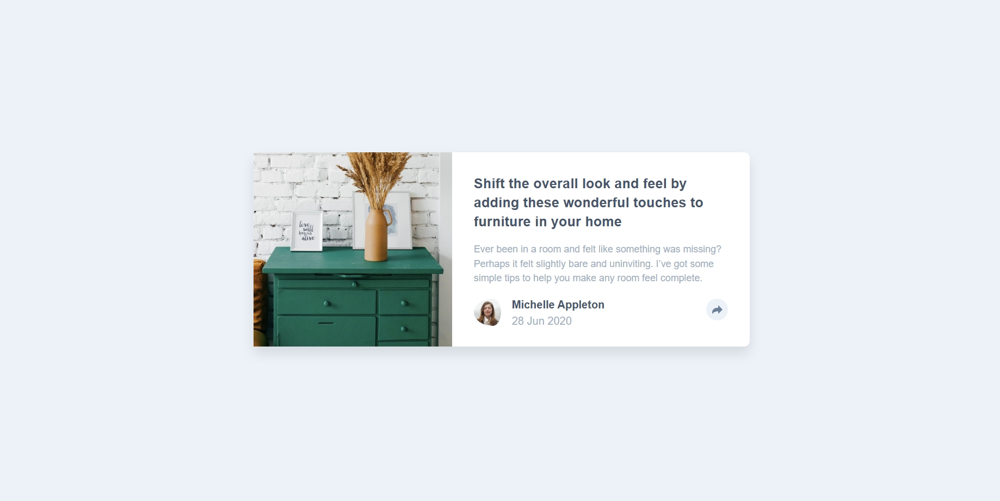
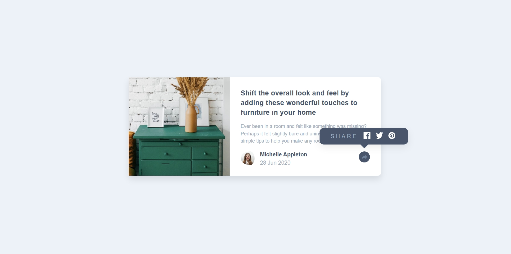
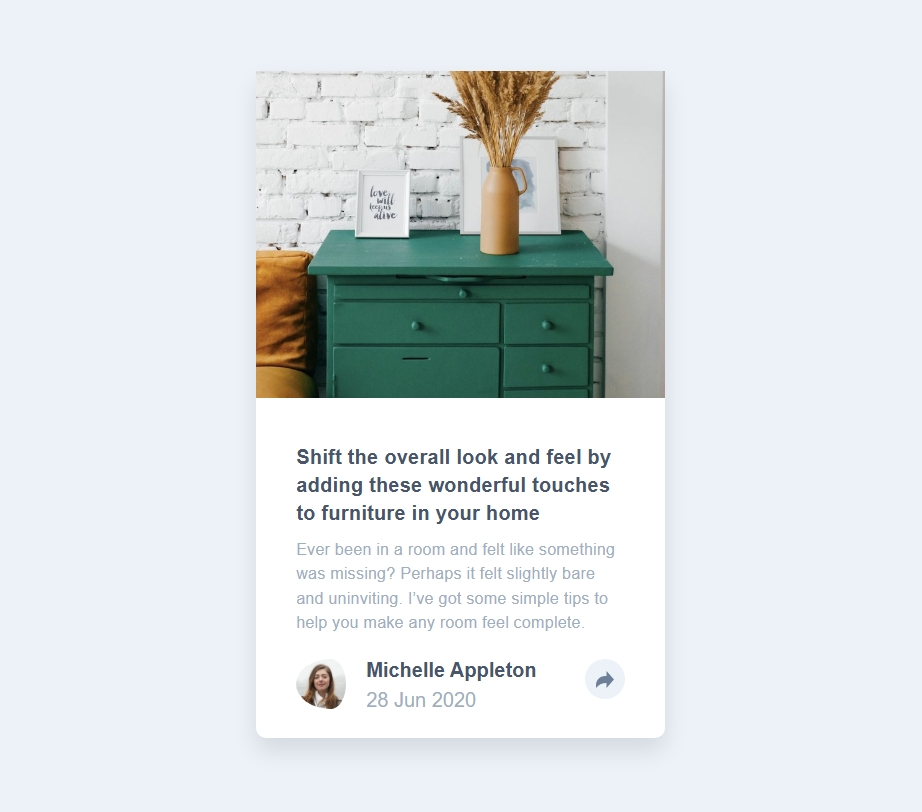
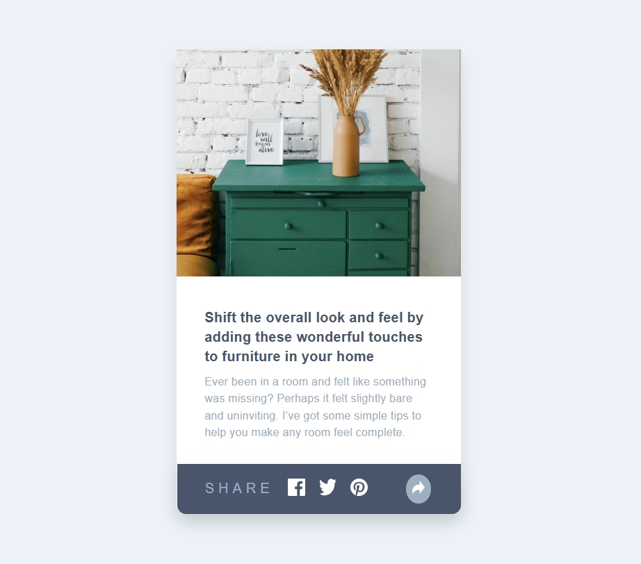

# Frontend Mentor - Article preview component solution

This is a solution to the [Article preview component challenge on Frontend Mentor](https://www.frontendmentor.io/challenges/article-preview-component-dYBN_pYFT). Frontend Mentor challenges help you improve your coding skills by building realistic projects. 

## Table of contents

- [Overview](#overview)
  - [The challenge](#the-challenge)
  - [Screenshot](#screenshot)
  - [Links](#links)
- [My process](#my-process)
  - [Built with](#built-with)
  - [What I learned](#what-i-learned)
  - [Continued development](#continued-development)
  - [Useful resources](#useful-resources)
- [Author](#author)
- [Acknowledgments](#acknowledgments)

**Note: Delete this note and update the table of contents based on what sections you keep.**

## Overview

### The challenge

Users should be able to:

- View the optimal layout for the component depending on their device's screen size
- See the social media share links when they click the share icon

### Screenshot

### Links

- Solution URL: [GitHub Repo](https://github.com/DANY-DURAND/frontend-mentor-challeges/tree/main/article-preview-component-master)
- Live Site URL: [Live URL](https://blog-card-frm.netlify.app/article-preview-component-master/)

## My process

### Built with

- Semantic HTML5 markup
- CSS custom properties
- Flexbox
- JavaScript

### What I learned

I learnt a great deal about JavaScript and jQuery. I also learnt a lot on position and ::after in CSS. 

### Useful resources

- [Udemy - The Complete Full-Stack Web Development Bootcamp](https://www.udemy.com/course/the-complete-web-development-bootcamp/) - This helped me for JavaScript and jQuery. I really liked the way the course is structured.

## Author

- Website - [Dany-Duran's Portfolio](https://dany-duran-portfolio.netlify.app/)
- Frontend Mentor - [@DANY-DURAND](https://www.frontendmentor.io/profile/DANY-DURAND)
- X - [@nzigamasabo_du](https://www.x.com/nzigamasabo_du)

## Acknowledgments

Learned a lot through the solution of [@makogeboris](https://www.frontendmentor.io/profile/makogeboris). It had a lot of clever design that made it stood out.
