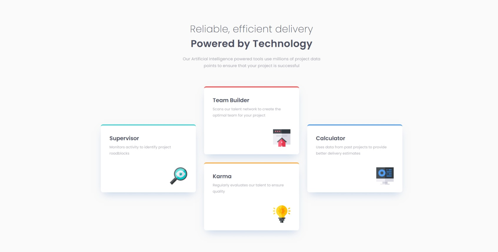

# Frontend Mentor - Four card feature section solution

This is a solution to the [Four card feature section challenge on Frontend Mentor](https://www.frontendmentor.io/challenges/four-card-feature-section-weK1eFYK). Frontend Mentor challenges help you improve your coding skills by building realistic projects. 

## Table of contents

- [Overview](#overview)
  - [The challenge](#the-challenge)
  - [Screenshot](#screenshot)
  - [Links](#links)
- [My process](#my-process)
  - [Built with](#built-with)
  - [What I learned](#what-i-learned)
  - [Continued development](#continued-development)
  - [Useful resources](#useful-resources)
- [Author](#author)

## Overview

### The challenge

Users should be able to:

- View the optimal layout for the site depending on their device's screen size

### Screenshot

### Links

- Solution URL: [GitHub Repository](https://github.com/DANY-DURAND/frontend-mentor-challenges/tree/main/four-card-feature-section)
- Live Site URL: [Live URL](https://blog-card-frm.netlify.app/four-card-feature-section)

## My process

### Built with

- Semantic HTML5 markup
- CSS custom properties
- Flexbox
- CSS Grid

### What I learned

I learned CSS grid but still need to learn more

### Continued development

I will continue to practice CSS grid.

### Useful resources

- [Become a Full-Stack Web Developer on Udemy](https://www.udemy.com/share/1013gG3@DmzHxAtxxs63ZYwCZY9cC0IXF-nQHU_npmWAnzzEkF8gZ-AIPdOjU_prekpt5ypc_g==/) - Very good course!

## Author

- Frontend Mentor - [@DANY-DURAND](https://www.frontendmentor.io/profile/DANY-DURAND)
- X - [@nzigamasabo_du](https://www.x.com/nzigamasabo_du)