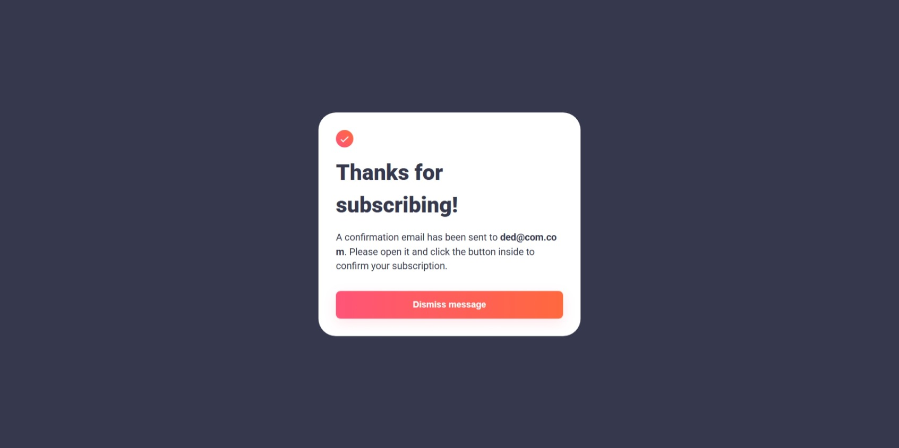
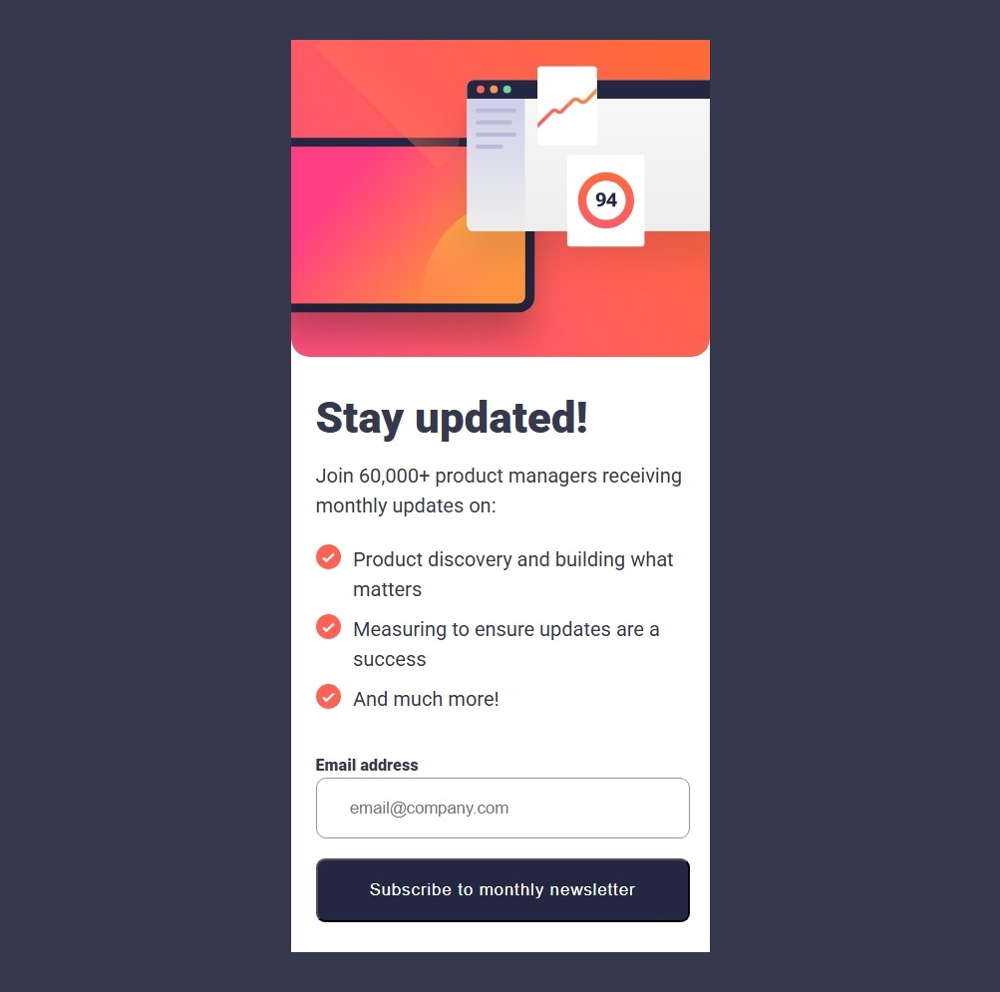
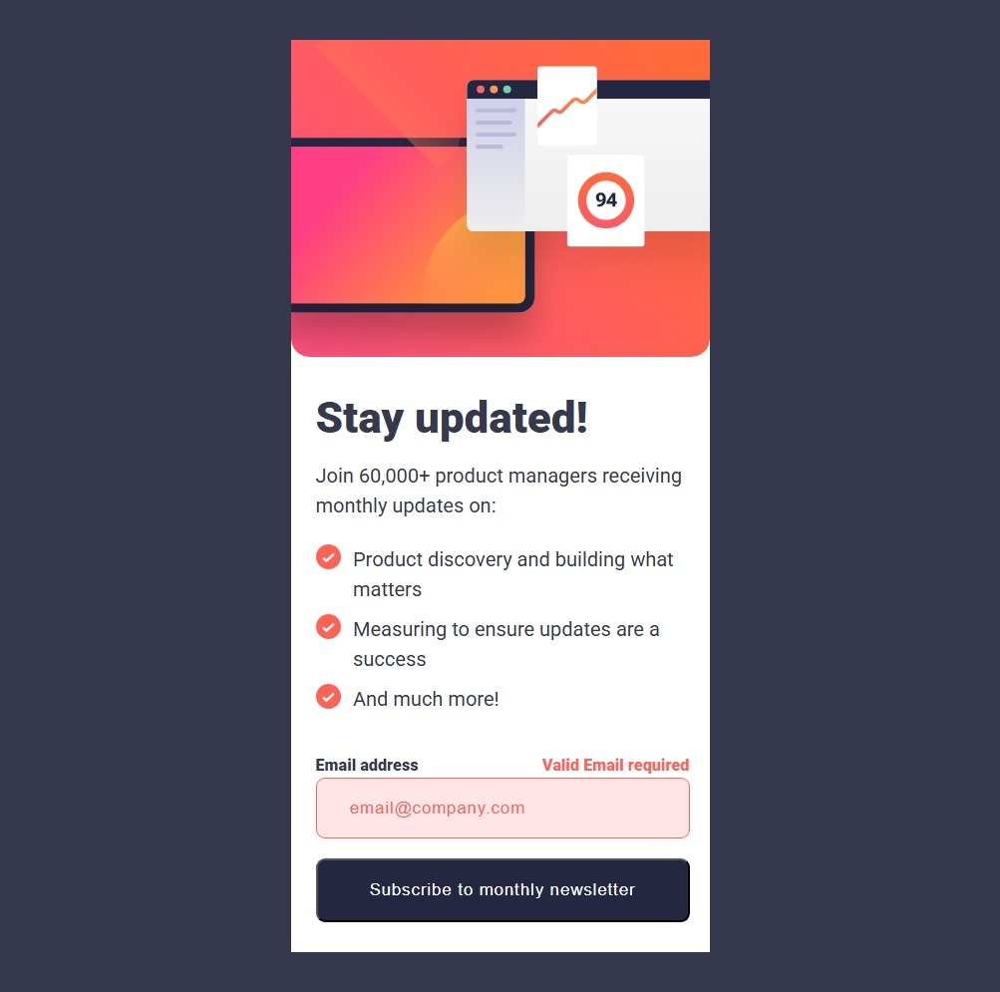
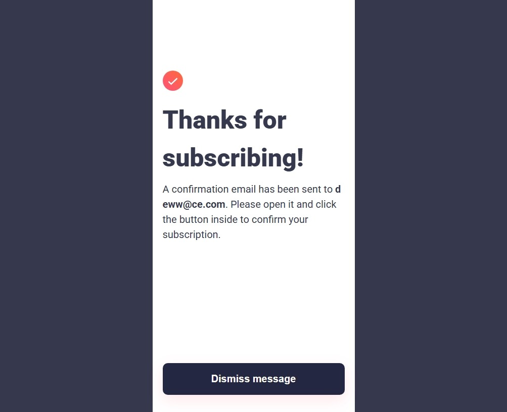

# Frontend Mentor - Article preview component solution

This is a solution to the [Article preview component challenge on Frontend Mentor](https://www.frontendmentor.io/challenges/article-preview-component-dYBN_pYFT). Frontend Mentor challenges help you improve your coding skills by building realistic projects. 

## Table of contents

- [Overview](#overview)
  - [The challenge](#the-challenge)
  - [Screenshot](#screenshot)
  - [Links](#links)
- [My process](#my-process)
  - [Built with](#built-with)
  - [What I learned](#what-i-learned)
  - [Useful resources](#useful-resources)
- [Author](#author)

**Note: Delete this note and update the table of contents based on what sections you keep.**

## Overview

### The challenge

Users should be able to:

- View the optimal layout for the component depending on their device's screen size
- See the social media share links when they click the share icon

### Screenshot









### Links

- Solution URL: [GitHub Repo](https://github.com/DANY-DURAND/frontend-mentor-challeges/tree/main/newsletter-sign-up-with-success-message-main/)
- Live Site URL: [Live URL](https://blog-card-frm.netlify.app/newsletter-sign-up-with-success-message-main/)

## My process

### Built with

- Semantic HTML5 markup
- CSS custom properties
- Flexbox
- JavaScript


### What I learned

I learnt how to style the placeholder text.

```css
.error-style::placeholder,
.email-input.error::placeholder {
    color: var(--Red);
    opacity: 1;
}
```

I also learnt about client-side validation with JavaScript and some event handling.

```js
const emailRegExp = /^[^\s@]+@[^\s@]+\.[^\s@]+$/;

function validateEmail(email) {
  return emailRegExp.test(email);
}
```


### Useful resources

- [Frontend Mentor](https://www.frontendmentor.io/learning-paths/javascript-fundamentals-oR7g6-mTZ-/steps/68275ea05526abd74499e050/article/read) - This is a great article.
- [MDN WEB DOCS](https://developer.mozilla.org/en-US/docs/Learn_web_development/Extensions/Forms/Form_validation)- A bit overwhelming but good.
- [FreeCodeCamp](https://www.freecodecamp.org/news/build-and-validate-beautiful-forms-with-vanilla-html-css-js/) - Concise with great value Article.


## Author

- Website - [Dany-Duran's Portfolio](https://dany-duran-portfolio.netlify.app/)
- Frontend Mentor - [@DANY-DURAND](https://www.frontendmentor.io/profile/DANY-DURAND)
- X - [@nzigamasabo_du](https://www.x.com/nzigamasabo_du)