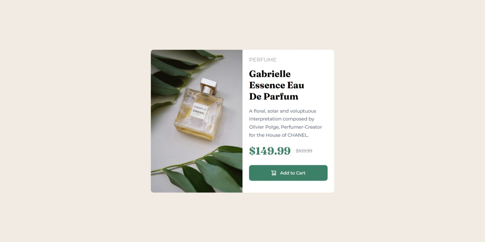
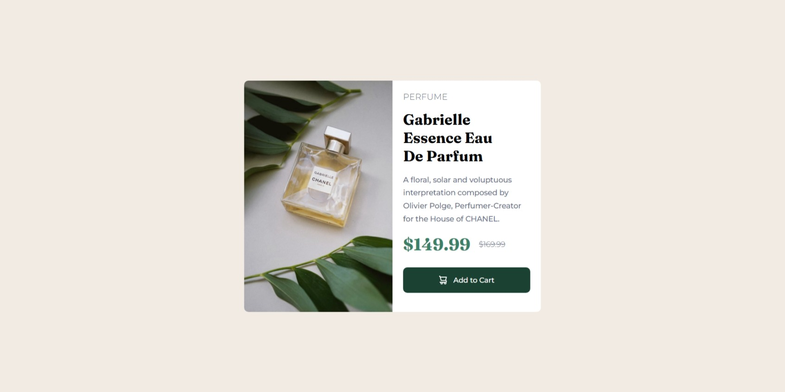

# Frontend Mentor - Product preview card component solution

This is a solution to the [Product preview card component challenge on Frontend Mentor](https://www.frontendmentor.io/challenges/product-preview-card-component-GO7UmttRfa). Frontend Mentor challenges help you improve your coding skills by building realistic projects. 

## Table of contents

- [Overview](#overview)
  - [The challenge](#the-challenge)
  - [Screenshot](#screenshot)
  - [Links](#links)
- [My process](#my-process)
  - [Built with](#built-with)
  - [What I learned](#what-i-learned)
  - [Continued development](#continued-development)
  - [Useful resources](#useful-resources)
- [Author](#author)

## Overview

### The challenge

Users should be able to:

- View the optimal layout depending on their device's screen size
- See hover and focus states for interactive elements

### Screenshot





### Links

- Solution URL: [GitHub Repository](https://github.com/DANY-DURAND/frontend-mentor-challenges/tree/main/product-preview-card-component-main)
- Live Site URL: [Live URL](https://blog-card-frm.netlify.app/product-preview-card-component-main)

## My process

### Built with

- Semantic HTML5 markup
- CSS custom properties
- Flexbox

### What I learned

I learnt how to use picture for the first time and how to change image source without using JavaScript.

```html
  <picture class="product-image">
    <source media="(max-width: 375px)" srcset="./images/image-product-mobile.jpg">
    
  </picture>
```

### Continued development

- Do this project with some JavaScript or React.

### Useful resources

- [Mkerr GitHub](https://github.com/mkerr-github/product-preview-card/blob/master) - I learnt a great deal from his solution. It is very concise and professional.

## Author

- Frontend Mentor - [@DANY-DURAND](https://www.frontendmentor.io/profile/DANY-DURAND)
- X - [@nzigamasabo_du](https://www.x.com/nzigamasabo_du)

