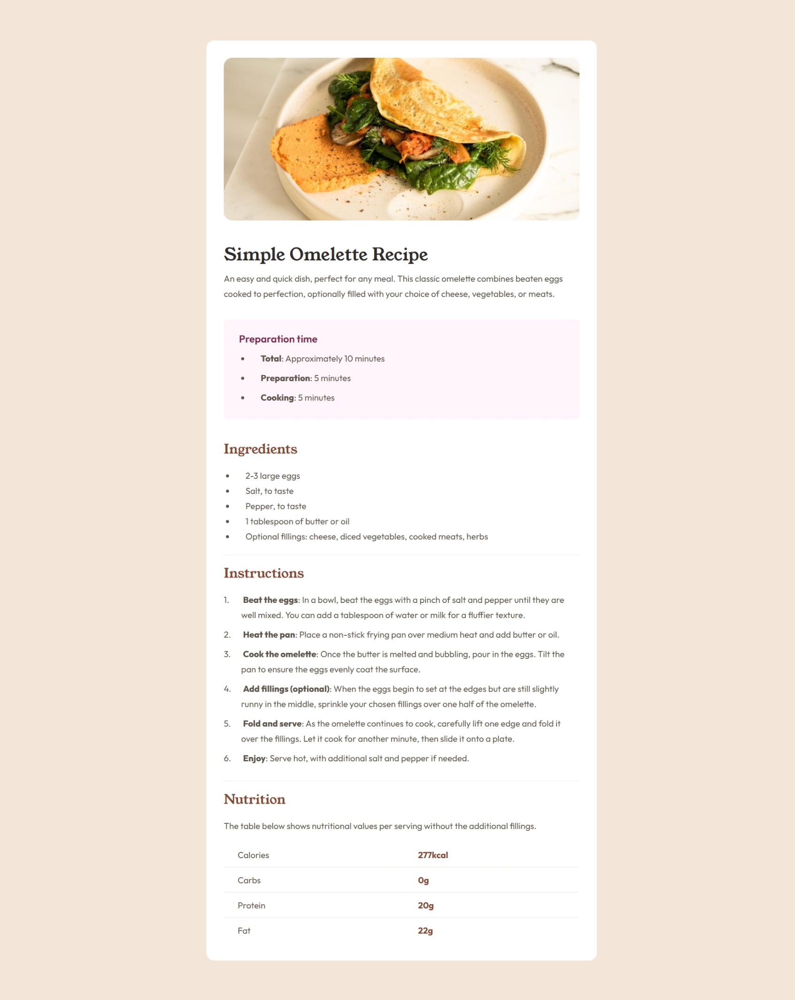
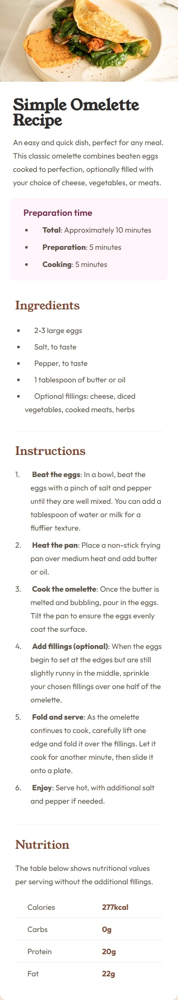

# Frontend Mentor - Recipe page solution

This is a solution to the [Recipe page challenge on Frontend Mentor](https://www.frontendmentor.io/challenges/recipe-page-KiTsR8QQKm). Frontend Mentor challenges help you improve your coding skills by building realistic projects. 

## Table of contents

- [Overview](#overview)
  - [The challenge](#the-challenge)
  - [Screenshot](#screenshot)
  - [Links](#links)
- [My process](#my-process)
  - [Built with](#built-with)
  - [What I learned](#what-i-learned)
  - [Continued development](#continued-development)
  - [Useful resources](#useful-resources)
- [Author](#author)
- [Acknowledgments](#acknowledgments)

## Overview

### Screenshot

### Links

- Solution URL: [GitHub Repository](https://github.com/DANY-DURAND/frontend-mentor-challenges/tree/main/recipe-page-main)
- Live Site URL: [Live URL](https://blog-card-frm.netlify.app/recipe-page-main)

## My process

### Built with

- Semantic HTML5 markup
- CSS custom properties
- Flexbox
- Media Query
- Table

### What I learned

### Useful resources

- [Styling line element](https://www.w3schools.com/howto/howto_css_style_hr.asp)
- [List styling](https://developer.mozilla.org/en-US/docs/Learn_web_development/Core/Text_styling/Styling_lists)
- [ Custom List numbering](https://stackoverflow.com/questions/10877/how-can-you-customize-the-numbers-in-an-ordered-list)

## Author

- Frontend Mentor - [@DANY-DURAND](https://www.frontendmentor.io/profile/DANY-DURAND)
- X - [@nzigamasabo_du](https://www.x.com/nzigamasabo_du)

## Acknowledgments

This is where you can give a hat tip to anyone who helped you out on this project. Perhaps you worked in a team or got some inspiration from someone else's solution. This is the perfect place to give them some credit.
