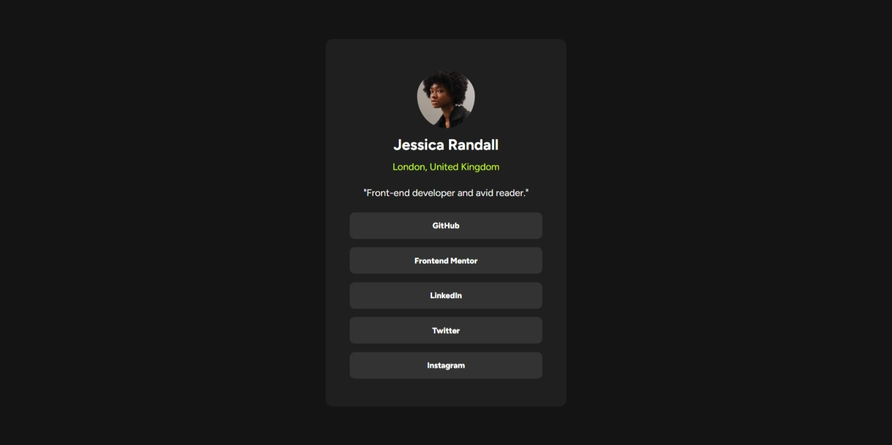
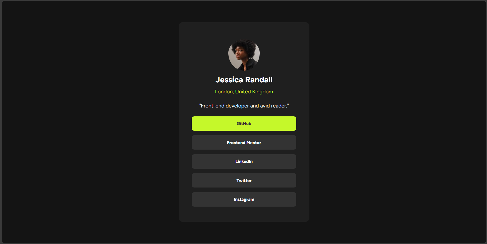
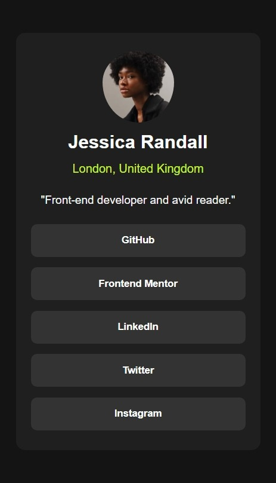

# Frontend Mentor - Social links profile solution

This is a solution to the [Social links profile challenge on Frontend Mentor](https://www.frontendmentor.io/challenges/social-links-profile-UG32l9m6dQ). Frontend Mentor challenges help you improve your coding skills by building realistic projects. 

## Table of contents

- [Overview](#overview)
  - [The challenge](#the-challenge)
  - [Screenshot](#screenshot)
  - [Links](#links)
- [My process](#my-process)
  - [Built with](#built-with)
  - [What I learned](#what-i-learned)
  - [Useful resources](#useful-resources)
- [Author](#author)

## Overview

### The challenge

Users should be able to:

- See hover and focus states for all interactive elements on the page

### Screenshot

### Links

- Solution URL: [GitHub URL](https://github.com/DANY-DURAND/frontend-mentor-challenges/tree/main/social-links-profile-main)
- Live Site URL: [Netlify URL](https://blog-card-frm.netlify.app/social-links-profile-main/)

## My process

### Built with

- Html5
- CSS custom properties
- Flexbox
- Media query

### What I learned

I reinforced the knowledge of flexbox, media query, and what I learned in the previous challenge.

### Useful resources

- [MDN](https://developer.mozilla.org/en-US/docs/Web/CSS/CSS_media_queries/Using_media_queries)
- [W3schools](https://www.w3schools.com/cssref/atrule_media.php)
- [Slaying The Dragon - Youtube](https://youtu.be/K24lUqcT0Ms?si=7SrrsfPT9flC6K42)

## Author

- Frontend Mentor - [@DANY-DURAND](https://www.frontendmentor.io/profile/DANY-DURAND)
- Twitter - [@nzigamasabo_du](https://www.twitter.com/nzigamasabo_du)