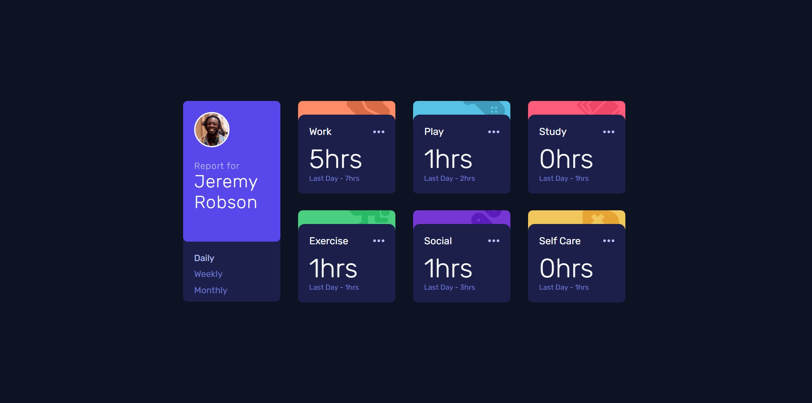
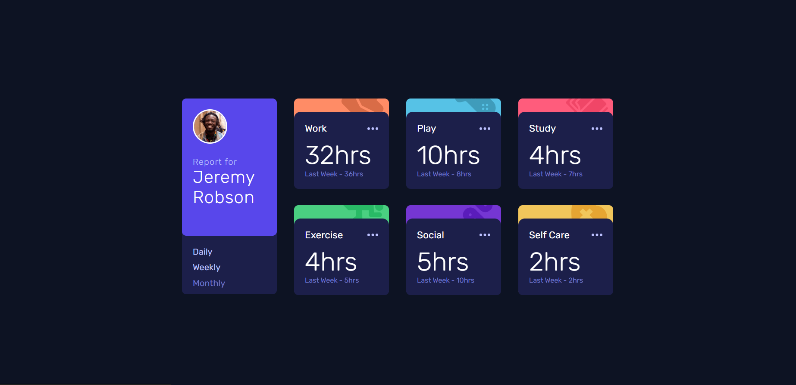
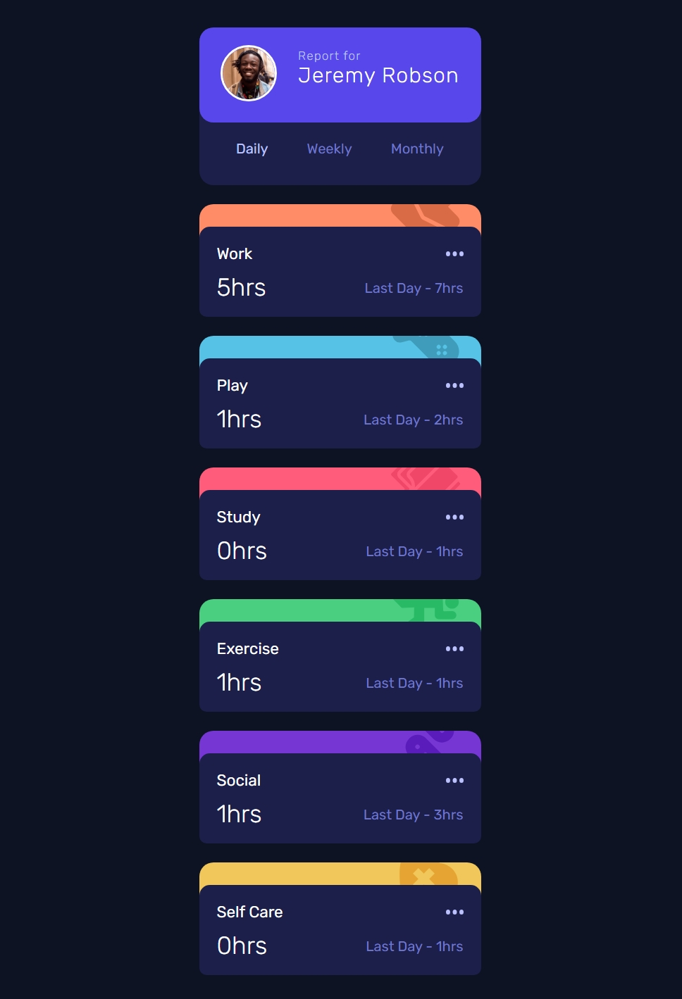

# Frontend Mentor - Time tracking dashboard solution

This is a solution to the [Time tracking dashboard challenge on Frontend Mentor](https://www.frontendmentor.io/challenges/time-tracking-dashboard-UIQ7167Jw). Frontend Mentor challenges help you improve your coding skills by building realistic projects. 

## Table of contents

- [Overview](#overview)
  - [The challenge](#the-challenge)
  - [Screenshot](#screenshot)
  - [Links](#links)
- [My process](#my-process)
  - [Built with](#built-with)
  - [What I learned](#what-i-learned)
  - [Useful resources](#useful-resources)
- [Author](#author)
## Overview

### The challenge

Users should be able to:

- View the optimal layout for the site depending on their device's screen size
- See hover states for all interactive elements on the page
- Switch between viewing Daily, Weekly, and Monthly stats

### Screenshot





### Links

- Solution URL: [GitHub Repo](https://github.com/DANY-DURAND/frontend-mentor-challenges/blame/main/time-tracking-dashboard-main/)
- Live Site URL: [Live URL](https://blog-card-frm.netlify.app/time-tracking-dashboard-main/)

## My process

### Built with

- Semantic HTML5 markup
- CSS custom properties
- Flexbox
- CSS Grid
- JavaScript


### What I learned

I learned how to work with data and asynchronous functions. I also leared how to use thde data attributes in CSS.


#### Example

```html
<div class="card work" data-title="Work">
  ...
</div>
```

```js
const card = document.querySelector(`.card[data-title="${activity.title}"]`);
```

### Useful resources

- [Frontend Mentor](https://www.frontendmentor.io/learning-paths/javascript-fundamentals-oR7g6-mTZ-/steps/68275ea05526abd74499e052/article/read) - This is a great article.
- [MDN WEB DOCS](https://developer.mozilla.org/en-US/docs/Web/HTML/How_to/Use_data_attributes)- A bit overwhelming but good.
- [FreeCodeCamp](https://www.freecodecamp.org/news/build-and-validate-beautiful-forms-with-vanilla-html-css-js/) - Concise with great value Article.

## Author

- Website - [Add your name here](https://www.your-site.com)
- Frontend Mentor - [@yourusername](https://www.frontendmentor.io/profile/yourusername)
- Website - [Dany-Duran's Portfolio](https://dany-duran-portfolio.netlify.app/)
- Frontend Mentor - [@DANY-DURAND](https://www.frontendmentor.io/profile/DANY-DURAND)
- X - [@nzigamasabo_du](https://www.x.com/nzigamasabo_du)


